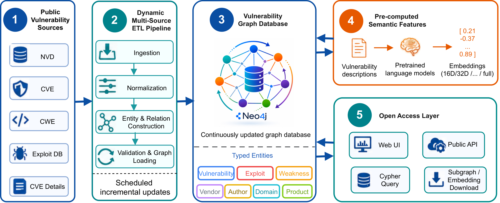

# VulLink: A Dynamic Open-Access Vulnerability Graph Database for Cybersecurity Data Mining



**VulLink** is a deployed, dynamic, and open-access vulnerability graph database designed for cybersecurity data mining. It integrates fragmented vulnerability records from multiple public repositories—including NVD, CVE, CWE, ExploitDB, and CVE Details—into a continuously updated Neo4j property graph with explicit cross-source relationships.

VulLink provides:

* Automated multi-source ETL pipelines
* A continuously updated vulnerability graph database
* Interactive graph visualization and exploration
* Public API access for graph querying and data retrieval
* Pre-computed semantic embeddings of vulnerability descriptions
* Reproducible resources for downstream cybersecurity data mining

The repository contains the complete source code for the VulLink platform, including the ETL pipeline, API backend, visualization interface, deployment resources, and downstream mining demonstrations.

---

# Repository Architecture

The project is organized into four primary components.

| Component                  | Description                                                                                                    |
| -------------------------- | -------------------------------------------------------------------------------------------------------------- |
| **VulLink/**               | Core configuration files, Neo4j deployment resources, utilities, and analysis notebooks.                       |
| **VulLink-API/**           | FastAPI backend exposing graph query, subgraph retrieval, and embedding access endpoints.                      |
| **VulLink-Visualizer/**    | React-based frontend for graph exploration, Cypher querying, and data export.                                  |
| **VulLink-Data-Pipeline/** | ETL pipeline responsible for vulnerability ingestion, normalization, graph construction, and database updates. |

## Directory Layout

```text
VulLink/
├── data/
├── figures/
├── VulLink/
├── VulLink-API/
├── VulLink-Data-Pipeline/
├── VulLink-Visualizer/
├── .env.development
└── docker-compose.yml
```

---

# Prerequisites

To deploy VulLink locally, install:

* Docker and Docker Compose
* Python 3.12+
* Node.js 14+
* Neo4j Community Edition 4.4.11 (for native deployment)

---

# Quick Start

## 1. Configure Environment Variables

Create a `.env` file in the repository root.

```env
REACT_APP_NEO4J_URL=bolt://localhost:7687
REACT_APP_NEO4J_USER=neo4j
REACT_APP_NEO4J_PASSWORD=your_password
REACT_APP_BACKEND_URL=http://localhost:8000
```

## 2. Launch the Full Stack

```bash
docker-compose up --build -d
```

### Access Points

* Frontend: http://localhost
* API Documentation: http://localhost:8000/docs

---

# Local Development

## Graph Integration Pipeline

```bash
cd VulLink-Data-Pipeline
```

Configure:

```text
pipeline_config.json
config.py
```

Run:

```bash
python main.py
```

or:

```bash
python nvd_pipeline_new.py
```

---

## API Backend

```bash
cd VulLink-API

python -m venv venv
source venv/bin/activate

pip install -r requirements.txt
```

Start API:

```bash
npx dotenv-cli -e ..\.env.development -- uvicorn app.main:app --reload
```

Run tests:

```bash
npx dotenv-cli -e ..\.env.development -- python tests/test_endpoints.py
```

---

## Frontend Visualizer

```bash
cd VulLink-Visualizer

npm install

npx dotenv-cli -e ..\.env.development -- npm start
```

---

# Database Construction Pipeline

VulLink continuously integrates vulnerability intelligence from multiple public repositories:

* National Vulnerability Database (NVD)
* Common Vulnerabilities and Exposures (CVE)
* Common Weakness Enumeration (CWE)
* Exploit Database (ExploitDB)
* CVE Details

The ETL framework performs:

1. Data ingestion
2. Data cleaning and normalization
3. Entity construction
4. Relationship construction
5. Graph validation
6. Incremental graph loading

The graph currently models the following entity types:

* Vulnerability
* Exploit
* Weakness
* Product
* Vendor
* Author
* Domain

Relationship types include:

* AFFECTS
* EXPLOITS
* EXAMPLE_OF
* BELONGS_TO
* WRITES
* REFERS_TO

The resulting graph database contains over **545,000 nodes** and **1.6 million relationships**, supporting large-scale cybersecurity analytics and graph mining.

---

# Deploying the Base VulKG Graph

VulLink builds upon the **VulKG** graph schema proposed in previous research. The original VulKG schema and graph construction methodology are not contributions of this repository.

VulLink extends this foundation through:

* Dynamic multi-source ETL integration
* Automated incremental updates
* Open-access API services
* Interactive graph visualization
* Pre-computed semantic embeddings
* Cybersecurity data mining utilities

To deploy the original VulKG graph:

## Requirements

* Neo4j Desktop 1.4.15 or newer
* Neo4j Community Edition 4.4.11
* APOC Plugin
* Graph Data Science (GDS) Plugin

## Deployment Steps

### 1. Create a Neo4j Project

Create a project named:

```text
VulKG Project
```

### 2. Create a Local DBMS

Create a DBMS named:

```text
Graph DBMS
```

Use:

```text
Neo4j Version: 4.4.11
Password: Neo4j
```

### 3. Install Plugins

Install:

* APOC
* Graph Data Science Library

### 4. Enable APOC File Import

Add the following line to the Neo4j configuration file:

```text
apoc.import.file.enabled=true
```

This resolves:

```text
Failed to invoke procedure `apoc.periodic.iterate`
Import from files not enabled
```

### 5. Import Data

Copy all required import files into the Neo4j import directory.

### 6. Open Neo4j Browser

Enable:

```text
Enable multi statement query editor
```

### 7. Deploy the Graph

Execute the Cypher script:

```text
VulLink/src/neo4j/VulKG_Deployment_Cypher.cypher
```

This script creates the original VulKG graph structure used as the foundation for VulLink.

---

# Open Access and Data Retrieval

VulLink exposes graph data through both a Web interface and a public API.

Available functionality includes:

* Interactive graph visualization
* Cypher query execution
* Custom subgraph extraction
* Node export
* Relationship export
* Embedding download

Researchers can retrieve task-specific vulnerability subgraphs without rebuilding the underlying database.

Example applications include:

* Vulnerability prioritization
* Threat intelligence analysis
* Vulnerability clustering
* Graph representation learning
* Link prediction
* Graph neural network benchmarking

---

# Pre-computed Semantic Features

VulLink provides downloadable embeddings generated from vulnerability descriptions using:

* SecBERT
* MPNet
* FastText

Embeddings are available through both the Web interface and API with options for preferred vectors' dimension, enabling direct integration into downstream machine learning workflows.

---

# Demonstration: Exploitability Prediction

To demonstrate the utility of VulLink for downstream cybersecurity data mining, we provide an exploitability prediction case study.

The task predicts whether a vulnerability is associated with a known public exploit.

The study evaluates:

* Structured vulnerability attributes
* Vulnerability-description embeddings
* Graph-context features derived from VulLink

Results show that graph-based models consistently outperform non-graph baselines, highlighting the value of relational vulnerability intelligence for cybersecurity analytics.

This example serves as a reference workflow for:

* Vulnerability prioritization
* Graph-based security analytics
* Graph neural network research
* Cybersecurity representation learning

---

# Cybersecurity Data Mining Applications

VulLink is designed as a reusable graph data infrastructure for cybersecurity research.

Potential downstream applications include:

* Exploitability prediction
* Vulnerability prioritization
* Vulnerability clustering
* Knowledge graph mining
* Link prediction
* Graph representation learning
* Threat intelligence discovery
* Multi-hop vulnerability analysis
* Security recommendation systems
* Graph neural network benchmarking

---

# Citation

If you use VulLink in your research, please cite:

```bibtex
@article{do2026vullink,
  title={VulLink: A Dynamic Open-Access Vulnerability Graph Database for Cybersecurity Data Mining},
  author={Do, Luat and Cao, Jinli and Yin, Jiao and Wang, Hua},
  journal={arXiv preprint arXiv:2604.06967},
  year={2026}
}
```

---

# License

This project is released under the MIT License.

See the LICENSE files within the repository and component subprojects for additional licensing information.
